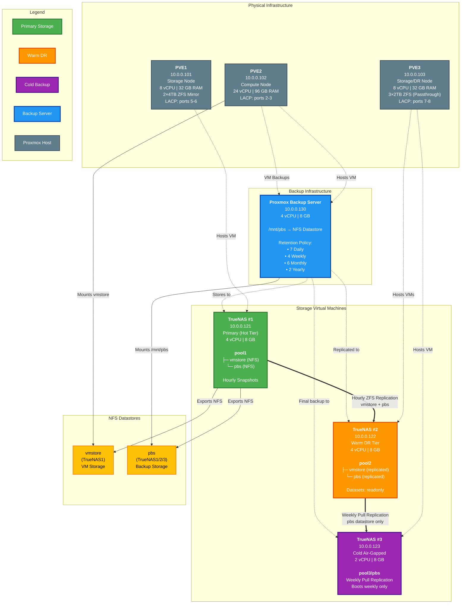

# HomeLab

Ce dépôt documente mon **laboratoire personnel d’infrastructure et de cybersécurité**.
Il modélise la montée en maturité d’une **petite à moyenne entreprise (PME)** au fil du temps, avec une progression hebdomadaire introduisant de nouvelles responsabilités, contraintes opérationnelles et capacités techniques.

---

## Table des matières

* **Vue d'ensemble** : [#lab-dinfrastructure](#lab-dinfrastructure)
* **Diagrammes d’architecture** :
  * Bureau simulé : [#bureau-simulé](#bureau-simulé)
  * Compute & stockage : [#architecture-compute--stockage](#architecture-compute--stockage)
  * Topologie complète : [#topologie-complète-du-lab](#topologie-complète-du-lab)
* **Feuille de route hebdomadaire** : [#progression-hebdomadaire](#progression-hebdomadaire)
* **Inventaire complet** : [#inventaire-du-lab](#inventaire-du-lab)

---

Ce lab a été conçu pour renforcer ma maîtrise des technologies vues en simulant
l’évolution réaliste d’une entreprise de petite à moyenne taille.

Le lab est géré comme si j’étais **l’unique administrateur TI**.
Chaque semaine correspond à une **étape de maturité organisationnelle**, documentée
dans la feuille de route hebdomadaire ([#progression-hebdomadaire](#progression-hebdomadaire)).

---

## Bureau simulé

Cette vue présente la structure logique des sites et leurs interconnexions. Elle sert de point de départ avant la consultation de la topologie complète qui intègre également l'infrastructure physique.

```mermaid
graph TB

    classDef internet fill:#263238,stroke:#000,color:#fff,stroke-width:3px

    classDef fw fill:#C62828,stroke:#8E0000,color:#fff,stroke-width:3px

    classDef dc fill:#1565C0,stroke:#0D47A1,color:#fff,stroke-width:3px

    classDef srv fill:#1976D2,stroke:#1565C0,color:#fff,stroke-width:2px

    classDef client fill:#F57C00,stroke:#E65100,color:#fff,stroke-width:2px

    classDef mgmt fill:#00897B,stroke:#004D40,color:#fff,stroke-width:2px

    classDef proxy fill:#7B1FA2,stroke:#4A148C,color:#fff,stroke-width:3px

    classDef vlan fill:#ECEFF1,stroke:#90A4AE,color:#000,stroke-width:2px

    classDef tunnel fill:#6A1B9A,stroke:#4A148C,color:#fff,stroke-width:3px

    classDef remote fill:#D84315,stroke:#BF360C,color:#fff,stroke-width:2px

    classDef vault fill:#175DDC,stroke:#0D3A8C,color:#fff,stroke-width:3px

    classDef radius fill:#E91E63,stroke:#880E4F,color:#fff,stroke-width:3px

    classDef duo fill:#00A862,stroke:#007A47,color:#fff,stroke-width:3px

    classDef logging fill:#FF5722,stroke:#D84315,color:#fff,stroke-width:3px

    classDef sensor fill:#FFC107,stroke:#F57F17,color:#000,stroke-width:3px

  

    INTERNET["INTERNET"]:::internet

    subgraph DUO_CLOUD["Duo Security Cloud"]

        DUO["Duo Security<br/><br/>MFA Provider<br/><br/>Authentication Methods:<br/>• Duo Push<br/>• SMS Passcode<br/>• Phone Call<br/>• Hardware Token"]:::duo

    end

  

    subgraph REMOTE["Remote Access VPN (10.30.0.0/24)"]

        PC3["PC3<br/>Remote User<br/>OpenVPN Client<br/>Full-Tunnel → HQ<br/><br/>RADIUS Auth via NPS1<br/>AD Group: VPN_Users"]:::remote

    end

  

    PC3 -.->|OpenVPN_UDP_1194| INTERNET

    INTERNET <-.->|API_Calls| DUO

  

    subgraph HQ["HQ Site (10.10.0.0/16)"]

        HQ_FW["pfSense-HQ<br/>10.10.20.1<br/><br/>OpenVPN Server: 10.30.0.1<br/>WireGuard: 172.16.0.1<br/>VLANs: 20/30/40<br/><br/>MFA: Duo + RADIUS (NPS1)<br/><br/>Syslog → Graylog UDP 5140"]:::fw

  

        subgraph HQ_V20["VLAN 20 - Servers (10.10.20.0/24)"]

            DC1["DC1<br/>10.10.20.10<br/>Primary AD/DNS/DHCP/PKI<br/><br/>AD CS: Forest Root CA<br/>Issues *.corp.local wildcard<br/><br/>DNS Authority:<br/>mailcow.corp.local → 10.10.20.22<br/>portainer.corp.local → 10.10.20.22<br/>netbox.corp.local → 10.10.20.22<br/>wazuh.corp.local → 10.10.20.22<br/>bitwarden.corp.local → 10.10.20.22<br/>graylog.corp.local → 10.10.20.22<br/>nessus.corp.local → 10.10.20.22<br/><br/>NXLog/Sysmon → Graylog UDP 5142"]:::dc

            FS1["FS1<br/>10.10.20.11<br/>File Server<br/>SMB over Kerberos<br/><br/>NXLog → Graylog UDP 5142"]:::srv

            WAZUH["Wazuh-HQ<br/>10.10.20.12<br/>SIEM<br/>Port 443 (backend)<br/><br/>Monitors all sites"]:::srv

            NPS1["NPS1<br/>10.10.20.15 (pfSense GUI)<br/>10.10.20.16 (OpenVPN)<br/><br/>RADIUS + Duo Auth Proxy<br/><br/>Duo Integration Keys:<br/>• pfSense GUI: ikey_pfsense<br/>• OpenVPN: ikey_openvpn<br/>• Jump-HQ: ikey_rdp<br/><br/>Hard authorization boundary:<br/>• 10.10.20.15 → IT_Admins<br/>• 10.10.20.16 → VPN_Users<br/><br/>NXLog → Graylog UDP 5142"]:::radius

            PORTAINER["Portainer-HQ<br/>10.10.20.20<br/>Docker Mgmt<br/>Port 9443 (backend)<br/><br/>Manages all Docker LXCs"]:::mgmt

            NETBOX["NetBox-HQ<br/>10.10.20.21<br/>IPAM/DCIM<br/>Port 8000 (backend)<br/><br/>Source of Truth"]:::mgmt

            NGINX["nginx-hq (NPM)<br/>10.10.20.22<br/><br/>Central Reverse Proxy<br/>Port 443 (HTTPS)<br/><br/>*.corp.local wildcard cert<br/>(from DC1 AD CS)<br/><br/>Proxy Hosts:<br/>mailcow.corp.local → 10.10.20.30<br/>portainer.corp.local → 10.10.20.20:9443<br/>netbox.corp.local → 10.10.20.21:8000<br/>wazuh.corp.local → 10.10.20.12:443<br/>bitwarden.corp.local → 10.10.20.23:80<br/>graylog.corp.local → 10.10.20.24:9000<br/>nessus.corp.local → 10.10.20.26:8834"]:::proxy

            BITWARDEN["Bitwarden-HQ<br/>10.10.20.23<br/>Password Vault<br/>Port 80 (backend)<br/><br/>Docker unified image<br/>SMTP via Mailcow<br/><br/>Internal-only access"]:::vault

            GRAYLOG["Graylog-HQ<br/>10.10.20.24<br/>Centralized Logging<br/>Port 9000 (backend)<br/><br/>Inputs:<br/>• UDP 5140 (pfSense)<br/>• UDP 5141 (Linux rsyslog)<br/>• UDP 5142 (Windows NXLog)<br/>• TCP 5044 (Beats/Zeek)<br/><br/>Streams per source type<br/>No detection logic"]:::logging

            ZEEK["Zeek-HQ<br/>10.10.20.25 (mgmt only)<br/>Network Security Monitoring<br/><br/>Passive Sensor<br/>JSON logs → Filebeat<br/>Filebeat → Graylog TCP 5044<br/><br/>Tap Interfaces (no IPs):<br/>• ens19 (LAN mirror)<br/>• ens20 (WAN mirror)<br/><br/>Proxmox tc ingress mirroring"]:::sensor

            MAILCOW["Mailcow-HQ<br/>10.10.20.30<br/>Mail Server<br/><br/>LDAP Auth (DC1)<br/>Auto mailbox provisioning<br/><br/>SOGo Webmail Only<br/>(No Outlook/IMAP/SMTP to clients)"]:::srv
            
            NESSUS["nessus-hq<br/>10.10.20.26<br/>Vulnerability Scanner<br/><br/>Nessus Essentials Plus<br/>Credentialed + Non-Credentialed Scans<br/><br/>Scan Targets:<br/>• VLAN 20 Servers<br/>• Jump-HQ"]:::mgmt

        end

  

        subgraph HQ_V30["VLAN 30 - Clients (10.10.30.0/24)"]

            UTIL_HQ["Utility-HQ<br/>DHCP<br/>Linux Admin<br/>AD-joined<br/><br/>rsyslog → Graylog UDP 5141"]:::client

            JUMP["Jump-HQ<br/>10.10.30.50<br/>RDP Bastion<br/><br/>NLA + SSL<br/>Duo Windows Logon MFA<br/>Restricted: CORP\IT_Admins<br/><br/>NXLog → Graylog UDP 5142"]:::client

            PC1["PC1<br/>DHCP<br/>Test Client<br/><br/>"]:::client

        end

  

        subgraph HQ_V40["VLAN 40 - Guest (10.10.40.0/24)"]

            HQ_GUEST["Guest Devices<br/>Internet-Only"]:::client

        end

    end

  

    INTERNET --> HQ_FW

    HQ_FW --> HQ_V20

    HQ_FW --> HQ_V30

    HQ_FW --> HQ_V40

  

    subgraph WG["WireGuard Site-to-Site"]

        TUNNEL["172.16.0.1 ⇄ 172.16.0.2<br/><br/>Split-Tunnel<br/>10.10.0.0/16 ⇄ 10.20.0.0/16<br/><br/>Hardened ACLs:<br/>AD Replication | DNS | SMB | RDP<br/>Peer-scoped inbound rules<br/>Block + Log catch-all"]:::tunnel

    end

  

    HQ_FW <--> TUNNEL

  

    subgraph BRANCH["Branch Site (10.20.0.0/16)"]

        BR_FW["pfSense-Branch<br/>10.20.20.1<br/><br/>WireGuard: 172.16.0.2<br/>VLANs: 20/30/40<br/><br/>Independent WAN breakout<br/><br/>Syslog → Graylog UDP 5140"]:::fw

  

        subgraph BR_V20["VLAN 20 - Servers (10.20.20.0/24)"]

            DC2["DC2<br/>10.20.20.10<br/>Secondary AD/DNS/DHCP<br/><br/>Replicates with DC1<br/>AD Sites: HQ-Site, Branch-Site<br/><br/>NXLog → Graylog UDP 5142"]:::dc

        end

  

        subgraph BR_V30["VLAN 30 - Clients (10.20.30.0/24)"]

            UTIL_BR["Utility-Branch<br/>DHCP<br/>Linux Admin<br/>AD-joined<br/><br/>rsyslog → Graylog UDP 5141"]:::client

            PC2["PC2<br/>DHCP<br/>Test Client<br/><br/>"]:::client

        end

  

        subgraph BR_V40["VLAN 40 - Guest (10.20.40.0/24)"]

            BR_GUEST["Guest Devices<br/>Internet-Only"]:::client

        end

    end

  

    TUNNEL <--> BR_FW

    BR_FW --> BR_V20

    BR_FW --> BR_V30

    BR_FW --> BR_V40

    INTERNET -->|Independent_WAN| BR_FW

  

    %% Reverse Proxy Relationships

    NGINX -->|Proxies HTTPS| MAILCOW

    NGINX -->|Proxies HTTPS| BITWARDEN

    NGINX -->|Proxies HTTPS| PORTAINER

    NGINX -->|Proxies HTTPS| NETBOX

    NGINX -->|Proxies HTTPS| WAZUH

    NGINX -->|Proxies HTTPS| GRAYLOG

  

    %% Logging Relationships

    HQ_FW -.->|Syslog UDP 5140| GRAYLOG

    BR_FW -.->|Syslog UDP 5140 via WG| GRAYLOG

    DC1 -.->|NXLog UDP 5142| GRAYLOG

    DC2 -.->|NXLog UDP 5142 via WG| GRAYLOG

    FS1 -.->|NXLog UDP 5142| GRAYLOG

    NPS1 -.->|NXLog UDP 5142| GRAYLOG

    UTIL_HQ -.->|rsyslog UDP 5141| GRAYLOG

    UTIL_BR -.->|rsyslog UDP 5141 via WG| GRAYLOG

    JUMP -.->|NXLog UDP 5142| GRAYLOG

    ZEEK -.->|Filebeat TCP 5044| GRAYLOG

  

    %% Network Monitoring (Zeek)

    HQ_FW -.->|Traffic Mirror - tc| ZEEK

    HQ_V20 -.->|Traffic Mirror - tc| ZEEK

    HQ_V30 -.->|Traffic Mirror - tc| ZEEK

  

    %% Key Service Flows

    DC1 <-.->|AD_Replication| DC2

    DC1 -.->|Issues_Cert| NGINX

    WAZUH -.->|Agents| FS1

    WAZUH -.->|Agents| UTIL_HQ

    WAZUH -.->|Agents_via_WG| DC2

    WAZUH -.->|Agents_via_WG| UTIL_BR

    NPS1 -.->|RADIUS_Auth_10.10.20.15| HQ_FW

    NPS1 -.->|RADIUS_Auth_10.10.20.16| PC3

    NPS1 <-.->|Duo_Auth_Proxy| DUO

    PC2 -.->|RDP_via_WG| JUMP

    UTIL_BR -.->|SMB_via_WG| FS1

    PC3 -.->|VPN_Access| HQ_FW

    PORTAINER -.->|Manages| NETBOX

    PORTAINER -.->|Manages| BITWARDEN

    MAILCOW -.->|LDAP_Auth| DC1

    BITWARDEN -.->|SMTP_Notifications| MAILCOW

    JUMP -.->|Duo_MFA| NPS1

    JUMP <-.->|Duo_Windows_Logon| DUO
    
    NESSUS -.->|Vuln_Scans| HQ_V20
    NESSUS -.->|Vuln_Scans| JUMP
    
  

    subgraph NOTES["Key Features"]

        N1["• Multi-site AD with automatic replication"]

        N2["• Centralized SIEM monitoring all sites (Wazuh)"]

        N3["• Remote VPN: HQ-only access, RADIUS + Duo MFA"]

        N4["• Independent internet per site"]

        N5["• DHCP relay to domain controllers"]

        N6["• Jump-HQ: RDP bastion with Duo MFA"]

        N7["• Mailcow: AD-integrated webmail (SOGo only)"]

        N8["• nginx-hq: Central HTTPS reverse proxy"]

        N9["• All web services: *.corp.local → 10.10.20.22"]

        N10["• Bitwarden: Self-hosted password vault"]

        N11["• NPS1: Dual-IP RADIUS for hard authorization"]

        N12["• WireGuard: Hardened peer-scoped ACLs"]

        N13["• AD CS: *.corp.local wildcard certificate"]

        N14["• Duo Security: MFA for pfSense, OpenVPN, RDP"]

        N15["• Graylog: Centralized log aggregation"]

        N16["• Zeek: Passive network telemetry sensor"]

        N17["• Proxmox tc mirroring: Non-intrusive tap"]

        N18["• Segmented ingestion: One stream per source"]

    end
```


---

## Architecture Compute / Stockage

Diagramme détaillé : voir la section [#architecture-compute--stockage](#architecture-compute--stockage)
Cette section complète la vue réseau en détaillant l’exécution des workloads et la
protection des données.
Les stratégies de sauvegarde sont également listées dans la section [#inventaire-du-lab](#inventaire-du-lab).


---

## Topologie complète du lab

Cette vue regroupe l'ensemble des éléments décrits dans les sections précédentes, intégrant à la fois la structure logique des sites simulés et l'infrastructure physique de calcul et de stockage.

```mermaid
graph LR

    classDef internet fill:#212121,stroke:#000,color:#fff,stroke-width:4px

    classDef physical fill:#37474F,stroke:#263238,color:#fff,stroke-width:3px

    classDef storage fill:#1B5E20,stroke:#0D3C17,color:#fff,stroke-width:3px

    classDef backup fill:#0D47A1,stroke:#01579B,color:#fff,stroke-width:3px

    classDef fw fill:#C62828,stroke:#8E0000,color:#fff,stroke-width:3px

    classDef srv fill:#1565C0,stroke:#0D47A1,color:#fff,stroke-width:2px

    classDef client fill:#EF6C00,stroke:#BF360C,color:#fff,stroke-width:2px

    classDef mgmt fill:#00695C,stroke:#004D40,color:#fff,stroke-width:2px

    classDef network fill:#4A148C,stroke:#311B92,color:#fff,stroke-width:2px

    classDef switch fill:#5D4037,stroke:#3E2723,color:#fff,stroke-width:2px

    classDef proxy fill:#7B1FA2,stroke:#4A148C,color:#fff,stroke-width:3px

    classDef duo fill:#00A862,stroke:#007A47,color:#fff,stroke-width:3px

    classDef radius fill:#E91E63,stroke:#880E4F,color:#fff,stroke-width:3px

    classDef logging fill:#FF5722,stroke:#D84315,color:#fff,stroke-width:3px

    classDef sensor fill:#FFC107,stroke:#F57F17,color:#000,stroke-width:3px

  

    INTERNET["INTERNET"]:::internet

    subgraph DUO_CLOUD["Duo Security Cloud (External SaaS)"]

        DUO["<b>Duo Security</b><br/><br/>MFA Provider<br/><br/>Authentication Methods:<br/>• Duo Push<br/>• SMS Passcode<br/>• Phone Call<br/>• Hardware Token<br/><br/>Integrations:<br/>• RADIUS (via Auth Proxy)<br/>• Windows Logon<br/>• API (ikey/skey)"]:::duo

    end

    HOME_RTR["Home Router<br/>ISP Gateway<br/>10.0.0.1/24"]:::network

    INTERNET --> HOME_RTR

    INTERNET <-.->|API Calls| DUO

  

    subgraph HOME_LAN["Home Lab Network (10.0.0.0/24 - WAN)"]

        SWITCH["UniFi Switch Lite 8 PoE<br/><br/>LAG 1: Ports 5–6 → PVE1<br/>LAG 2: Ports 2–3 → PVE2<br/>LAG 3: Ports 7–8 → PVE3<br/><br/>LACP 802.3ad<br/>Hash: layer3+4"]:::switch

    end

  

    HOME_RTR --> SWITCH

  

    subgraph PVE1_HOST["PVE1 - Storage Node (10.0.0.101)"]

        PVE1_INFO["<b>Proxmox VE 9</b><br/>8 vCPU | 32 GB RAM<br/><br/>Local Storage:<br/>2×4TB ZFS Mirror<br/><br/>Network:<br/>bond0 → enp2s0f0 + enp2s0f1<br/>LACP → Switch Ports 5–6<br/><br/>vmbr0 (WAN)"]:::physical

        TN1["<b>TrueNAS #1</b><br/>VM ID: 1001<br/>10.0.0.121<br/>4 vCPU | 8 GB<br/><br/><b>Primary Storage (Hot)</b><br/><br/>pool1:<br/>├─ vmstore (NFS)<br/>└─ pbs (NFS)<br/><br/>Hourly Snapshots<br/>Replicates to TN2"]:::storage

    end

  

    SWITCH -->|LACP LAG 1| PVE1_INFO

    PVE1_INFO -->|LACP LAG 1| SWITCH

    PVE1_INFO -.->|Hosts VM| TN1

  

    subgraph PVE2_HOST["PVE2 - Compute Node (10.0.0.102)"]

        PVE2_INFO["<b>Proxmox VE 9</b><br/>24 vCPU | 96 GB RAM<br/><br/>Storage:<br/>NFS → TrueNAS1 vmstore<br/><br/>Network:<br/>bond0 → eno1 + enp1s0<br/>LACP → Switch Ports 2–3<br/><br/>vmbr0 (WAN)<br/>vmbr1 (HQ Trunk 20/30/40)<br/>vmbr2 (Branch Trunk 20/30/40)"]:::physical

  

        subgraph PBS_INFRA["Backup Infrastructure"]

            PBS["<b>Proxmox Backup Server</b><br/>VM ID: 1004<br/>10.0.0.130<br/>4 vCPU | 8 GB<br/><br/>/mnt/pbs → NFS<br/><br/>Retention:<br/>7D | 4W | 6M | 2Y"]:::backup

        end

  

        subgraph HQ_VIRTUAL["HQ Virtual Environment"]

            HQ_FW["<b>pfSense-HQ</b><br/>VM ID: 110<br/>1 vCPU | 512 MB<br/><br/>WAN: vmbr0<br/>LAN: vmbr1 (trunk)<br/><br/>10.10.20.1<br/>OpenVPN: 10.30.0.1<br/>WireGuard: 172.16.0.1<br/><br/>RADIUS Client:<br/>NPS1 10.10.20.15<br/><br/>Syslog → Graylog UDP 5140"]:::fw

            HQ_DC["<b>DC1</b><br/>VM ID: 112<br/>10.10.20.10<br/>2 vCPU | 4 GB<br/><br/>AD DS | DNS | DHCP<br/>AD CS (PKI)<br/><br/>*.corp.local wildcard<br/><br/>NXLog → Graylog UDP 5142"]:::srv

            HQ_FS["<b>FS1</b><br/>VM ID: 113<br/>10.10.20.11<br/>2 vCPU | 4 GB<br/><br/>File Server<br/><br/>NXLog → Graylog UDP 5142"]:::srv

            HQ_WAZUH["<b>Wazuh-HQ</b><br/>VM ID: 114<br/>10.10.20.12<br/>4 vCPU | 6 GB<br/><br/>SIEM"]:::srv

            HQ_NPS["<b>NPS1</b><br/>VM ID: 117<br/>10.10.20.15 (pfSense)<br/>10.10.20.16 (OpenVPN)<br/>2 vCPU | 4 GB<br/><br/>RADIUS Server<br/>Duo Auth Proxy<br/><br/>Integration Keys:<br/>• ikey_pfsense<br/>• ikey_openvpn<br/>• ikey_rdp<br/><br/>AD Groups:<br/>• IT_Admins (.15)<br/>• VPN_Users (.16)<br/><br/>NXLog → Graylog UDP 5142"]:::radius

            HQ_PORT["<b>Portainer</b><br/>VM ID: 118<br/>10.10.20.20<br/>LXC<br/><br/>Docker Mgmt"]:::mgmt

            HQ_NET["<b>NetBox</b><br/>VM ID: 119<br/>10.10.20.21<br/>LXC<br/><br/>IPAM/DCIM"]:::mgmt

            HQ_NGINX["<b>nginx-hq (NPM)</b><br/>VM ID: 121<br/>10.10.20.22<br/>LXC<br/><br/>Central Reverse Proxy<br/>*.corp.local wildcard"]:::proxy

            HQ_NESSUS["<b>Nessus-HQ</b><br/>VM ID: 126<br/>10.10.20.26<br/>2 vCPU | 4 GB<br/><br/>Vulnerability Scanner<br/><br/>Nessus Essentials Plus<br/>Credentialed + Non-Credentialed Scans<br/><br/>Scoped Targets Only"]:::mgmt

            HQ_GRAY["<b>Graylog-HQ</b><br/>VM ID: 124<br/>10.10.20.24<br/>4 vCPU | 8 GB<br/>LXC<br/><br/>Centralized Logging<br/><br/>Inputs:<br/>• UDP 5140 (pfSense)<br/>• UDP 5141 (Linux rsyslog)<br/>• UDP 5142 (Windows NXLog)<br/>• TCP 5044 (Beats/Zeek)<br/><br/>Streams per source type"]:::logging

            HQ_ZEEK["<b>Zeek-HQ</b><br/>VM ID: 125<br/>10.10.20.25 (mgmt only)<br/>2 vCPU | 4 GB<br/><br/>Network Security Monitoring<br/><br/>Passive Sensor<br/>JSON logs → Filebeat<br/>Filebeat → Graylog TCP 5044<br/><br/>Tap Interfaces (no IPs):<br/>• ens19 (LAN mirror)<br/>• ens20 (WAN mirror)<br/><br/>Proxmox tc ingress mirroring"]:::sensor

            HQ_MAIL["<b>Mailcow</b><br/>VM ID: 120<br/>10.10.20.30<br/>2 vCPU | 4 GB<br/><br/>Mail Server<br/>LDAP → DC1"]:::srv

            HQ_BIT["<b>Bitwarden</b><br/>VM ID: 122<br/>10.10.20.23<br/>1 vCPU | 2 GB<br/><br/>Password Vault<br/>SMTP → Mailcow"]:::srv

            HQ_UTIL["<b>Utility-HQ</b><br/>VM ID: 111<br/>VLAN 30<br/>1 vCPU | 1 GB<br/><br/>Admin Host<br/><br/>rsyslog → Graylog UDP 5141"]:::client

            HQ_JUMP["<b>Jump-HQ</b><br/>VM ID: 116<br/>10.10.30.50<br/>2 vCPU | 4 GB<br/><br/>RDP Bastion<br/><br/>Duo Windows Logon<br/>Restricted: IT_Admins<br/>NLA + SSL<br/><br/>NXLog → Graylog UDP 5142"]:::client

            HQ_PC1["<b>PC1</b><br/>VM ID: 115<br/>VLAN 30<br/>2 vCPU | 2 GB<br/><br/>Test Client"]:::client

        end

  

        subgraph BR_VIRTUAL["Branch Virtual Environment"]

            BR_FW["<b>pfSense-Branch</b><br/>VM ID: 210<br/>1 vCPU | 512 MB<br/><br/>WAN: vmbr0<br/>LAN: vmbr2 (trunk)<br/><br/>10.20.20.1<br/>WireGuard: 172.16.0.2<br/><br/>Syslog → Graylog UDP 5140"]:::fw

            BR_DC["<b>DC2</b><br/>VM ID: 212<br/>10.20.20.10<br/>2 vCPU | 4 GB<br/><br/>AD Replica<br/><br/>NXLog → Graylog UDP 5142"]:::srv

            BR_UTIL["<b>Utility-Branch</b><br/>VM ID: 211<br/>VLAN 30<br/>1 vCPU | 1 GB<br/><br/>Admin Host<br/><br/>rsyslog → Graylog UDP 5141"]:::client

            BR_PC2["<b>PC2</b><br/>VM ID: 215<br/>VLAN 30<br/>2 vCPU | 2 GB<br/><br/>Test Client"]:::client

        end

  

        subgraph REMOTE_VM["Remote Test Environment"]

            PC3["<b>PC3</b><br/>VM ID: 301<br/>10.0.x.x<br/>2 vCPU | 2 GB<br/><br/>OpenVPN Test<br/>vmbr0 (WAN)<br/><br/>RADIUS → NPS1<br/>Full-Tunnel → HQ"]:::client

        end

    end

  

    SWITCH -->|LACP LAG 2| PVE2_INFO

    PVE2_INFO -->|LACP LAG 2| SWITCH

  

    PVE2_INFO -.->|Runs All VMs| PBS_INFRA

    PVE2_INFO -.->|Runs All VMs| HQ_VIRTUAL

    PVE2_INFO -.->|Runs All VMs| BR_VIRTUAL

    PVE2_INFO -.->|Runs VM| REMOTE_VM

  

    subgraph PVE3_HOST["PVE3 - Storage/DR Node (10.0.0.103)"]

        PVE3_INFO["<b>Proxmox VE 9</b><br/>8 vCPU | 32 GB RAM<br/><br/>Local Storage:<br/>3×2TB ZFS (Passthrough)<br/><br/>Network:<br/>bond0 → enp3s0f0 + enp3s0f1<br/>LACP → Switch Ports 7–8<br/><br/>vmbr0 (WAN)"]:::physical

        TN2["<b>TrueNAS #2</b><br/>VM ID: 1002<br/>10.0.0.122<br/>4 vCPU | 8 GB<br/><br/><b>Warm DR Tier</b><br/>Readonly Replicas"]:::storage

        TN3["<b>TrueNAS #3</b><br/>VM ID: 1003<br/>2 vCPU | 8 GB<br/><br/><b>Cold Backup</b><br/>Air-Gapped<br/>Weekly Boot"]:::storage

    end

  

    SWITCH -->|LACP LAG 3| PVE3_INFO

    PVE3_INFO -->|LACP LAG 3| SWITCH

    PVE3_INFO -.->|Hosts VM| TN2

    PVE3_INFO -.->|Hosts VM| TN3

  

    %% Duo Integration Flows

    HQ_NPS <-.->|Duo Auth Proxy<br/>HTTPS API| DUO

    HQ_JUMP <-.->|Duo Windows Logon<br/>Direct Integration| DUO

    HQ_FW -.->|RADIUS Auth| HQ_NPS

    PC3 -.->|OpenVPN + RADIUS| HQ_FW

  

    %% Logging Relationships (Servers and Admin Hosts Only)

    HQ_FW -.->|Syslog UDP 5140| HQ_GRAY

    BR_FW -.->|Syslog UDP 5140 via WG| HQ_GRAY

    HQ_DC -.->|NXLog UDP 5142| HQ_GRAY

    BR_DC -.->|NXLog UDP 5142 via WG| HQ_GRAY

    HQ_FS -.->|NXLog UDP 5142| HQ_GRAY

    HQ_NPS -.->|NXLog UDP 5142| HQ_GRAY

    HQ_UTIL -.->|rsyslog UDP 5141| HQ_GRAY

    BR_UTIL -.->|rsyslog UDP 5141 via WG| HQ_GRAY

    HQ_JUMP -.->|NXLog UDP 5142| HQ_GRAY

    HQ_ZEEK -.->|Filebeat TCP 5044| HQ_GRAY

  

    %% Network Monitoring (Zeek Traffic Mirroring)

    HQ_FW -.->|Traffic Mirror - tc| HQ_ZEEK

    HQ_DC -.->|Traffic Mirror - tc| HQ_ZEEK

    HQ_FS -.->|Traffic Mirror - tc| HQ_ZEEK

  

    %% Service Relationships

    HQ_NGINX -.->|Proxies| HQ_MAIL

    HQ_NGINX -.->|Proxies| HQ_BIT

    HQ_NGINX -.->|Proxies| HQ_PORT

    HQ_NGINX -.->|Proxies| HQ_NET

    HQ_NGINX -.->|Proxies| HQ_WAZUH

    HQ_NGINX -.->|Proxies| HQ_GRAY

    HQ_NGINX -.->|Proxies| HQ_NESSUS

    HQ_DC -.->|Issues Cert| HQ_NGINX

    HQ_MAIL -.->|LDAP Auth| HQ_DC

    HQ_BIT -.->|SMTP| HQ_MAIL

    classDef internet fill:#212121,stroke:#000,color:#fff,stroke-width:4px

    classDef physical fill:#37474F,stroke:#263238,color:#fff,stroke-width:3px

    classDef storage fill:#1B5E20,stroke:#0D3C17,color:#fff,stroke-width:3px

    classDef backup fill:#0D47A1,stroke:#01579B,color:#fff,stroke-width:3px

    classDef fw fill:#C62828,stroke:#8E0000,color:#fff,stroke-width:3px

    classDef srv fill:#1565C0,stroke:#0D47A1,color:#fff,stroke-width:2px

    classDef client fill:#EF6C00,stroke:#BF360C,color:#fff,stroke-width:2px

    classDef mgmt fill:#00695C,stroke:#004D40,color:#fff,stroke-width:2px

    classDef network fill:#4A148C,stroke:#311B92,color:#fff,stroke-width:2px

    classDef switch fill:#5D4037,stroke:#3E2723,color:#fff,stroke-width:2px

    classDef proxy fill:#7B1FA2,stroke:#4A148C,color:#fff,stroke-width:3px

    classDef duo fill:#00A862,stroke:#007A47,color:#fff,stroke-width:3px

    classDef radius fill:#E91E63,stroke:#880E4F,color:#fff,stroke-width:3px

    classDef logging fill:#FF5722,stroke:#D84315,color:#fff,stroke-width:3px

    classDef sensor fill:#FFC107,stroke:#F57F17,color:#000,stroke-width:3px

  

    INTERNET["INTERNET"]:::internet

    subgraph DUO_CLOUD["Duo Security Cloud (External SaaS)"]

        DUO["<b>Duo Security</b><br/><br/>MFA Provider<br/><br/>Authentication Methods:<br/>• Duo Push<br/>• SMS Passcode<br/>• Phone Call<br/>• Hardware Token<br/><br/>Integrations:<br/>• RADIUS (via Auth Proxy)<br/>• Windows Logon<br/>• API (ikey/skey)"]:::duo

    end

    HOME_RTR["Home Router<br/>ISP Gateway<br/>10.0.0.1/24"]:::network

    INTERNET --> HOME_RTR

    INTERNET <-.->|API Calls| DUO

  

    subgraph HOME_LAN["Home Lab Network (10.0.0.0/24 - WAN)"]

        SWITCH["UniFi Switch Lite 8 PoE<br/><br/>LAG 1: Ports 5–6 → PVE1<br/>LAG 2: Ports 2–3 → PVE2<br/>LAG 3: Ports 7–8 → PVE3<br/><br/>LACP 802.3ad<br/>Hash: layer3+4"]:::switch

    end

  

    HOME_RTR --> SWITCH

  

    subgraph PVE1_HOST["PVE1 - Storage Node (10.0.0.101)"]

        PVE1_INFO["<b>Proxmox VE 9</b><br/>8 vCPU | 32 GB RAM<br/><br/>Local Storage:<br/>2×4TB ZFS Mirror<br/><br/>Network:<br/>bond0 → enp2s0f0 + enp2s0f1<br/>LACP → Switch Ports 5–6<br/><br/>vmbr0 (WAN)"]:::physical

        TN1["<b>TrueNAS #1</b><br/>VM ID: 1001<br/>10.0.0.121<br/>4 vCPU | 8 GB<br/><br/><b>Primary Storage (Hot)</b><br/><br/>pool1:<br/>├─ vmstore (NFS)<br/>└─ pbs (NFS)<br/><br/>Hourly Snapshots<br/>Replicates to TN2"]:::storage

    end

  

    SWITCH -->|LACP LAG 1| PVE1_INFO

    PVE1_INFO -->|LACP LAG 1| SWITCH

    PVE1_INFO -.->|Hosts VM| TN1

  

    subgraph PVE2_HOST["PVE2 - Compute Node (10.0.0.102)"]

        PVE2_INFO["<b>Proxmox VE 9</b><br/>24 vCPU | 96 GB RAM<br/><br/>Storage:<br/>NFS → TrueNAS1 vmstore<br/><br/>Network:<br/>bond0 → eno1 + enp1s0<br/>LACP → Switch Ports 2–3<br/><br/>vmbr0 (WAN)<br/>vmbr1 (HQ Trunk 20/30/40)<br/>vmbr2 (Branch Trunk 20/30/40)"]:::physical

  

        subgraph PBS_INFRA["Backup Infrastructure"]

            PBS["<b>Proxmox Backup Server</b><br/>VM ID: 1004<br/>10.0.0.130<br/>4 vCPU | 8 GB<br/><br/>/mnt/pbs → NFS<br/><br/>Retention:<br/>7D | 4W | 6M | 2Y"]:::backup

        end

  

        subgraph HQ_VIRTUAL["HQ Virtual Environment"]

            HQ_FW["<b>pfSense-HQ</b><br/>VM ID: 110<br/>1 vCPU | 512 MB<br/><br/>WAN: vmbr0<br/>LAN: vmbr1 (trunk)<br/><br/>10.10.20.1<br/>OpenVPN: 10.30.0.1<br/>WireGuard: 172.16.0.1<br/><br/>RADIUS Client:<br/>NPS1 10.10.20.15<br/><br/>Syslog → Graylog UDP 5140"]:::fw

            HQ_DC["<b>DC1</b><br/>VM ID: 112<br/>10.10.20.10<br/>2 vCPU | 4 GB<br/><br/>AD DS | DNS | DHCP<br/>AD CS (PKI)<br/><br/>*.corp.local wildcard<br/><br/>NXLog → Graylog UDP 5142"]:::srv

            HQ_FS["<b>FS1</b><br/>VM ID: 113<br/>10.10.20.11<br/>2 vCPU | 4 GB<br/><br/>File Server<br/><br/>NXLog → Graylog UDP 5142"]:::srv

            HQ_WAZUH["<b>Wazuh-HQ</b><br/>VM ID: 114<br/>10.10.20.12<br/>4 vCPU | 6 GB<br/><br/>SIEM"]:::srv

            HQ_NPS["<b>NPS1</b><br/>VM ID: 117<br/>10.10.20.15 (pfSense)<br/>10.10.20.16 (OpenVPN)<br/>2 vCPU | 4 GB<br/><br/>RADIUS Server<br/>Duo Auth Proxy<br/><br/>Integration Keys:<br/>• ikey_pfsense<br/>• ikey_openvpn<br/>• ikey_rdp<br/><br/>AD Groups:<br/>• IT_Admins (.15)<br/>• VPN_Users (.16)<br/><br/>NXLog → Graylog UDP 5142"]:::radius

            HQ_PORT["<b>Portainer</b><br/>VM ID: 118<br/>10.10.20.20<br/>LXC<br/><br/>Docker Mgmt"]:::mgmt

            HQ_NET["<b>NetBox</b><br/>VM ID: 119<br/>10.10.20.21<br/>LXC<br/><br/>IPAM/DCIM"]:::mgmt

            HQ_NGINX["<b>nginx-hq (NPM)</b><br/>VM ID: 121<br/>10.10.20.22<br/>LXC<br/><br/>Central Reverse Proxy<br/>*.corp.local wildcard"]:::proxy

            HQ_NESSUS["<b>Nessus-HQ</b><br/>VM ID: 126<br/>10.10.20.26<br/>2 vCPU | 4 GB<br/><br/>Vulnerability Scanner<br/><br/>Nessus Essentials Plus<br/>Credentialed + Non-Credentialed Scans<br/><br/>Scoped Targets Only"]:::mgmt

            HQ_GRAY["<b>Graylog-HQ</b><br/>VM ID: 124<br/>10.10.20.24<br/>4 vCPU | 8 GB<br/>LXC<br/><br/>Centralized Logging<br/><br/>Inputs:<br/>• UDP 5140 (pfSense)<br/>• UDP 5141 (Linux rsyslog)<br/>• UDP 5142 (Windows NXLog)<br/>• TCP 5044 (Beats/Zeek)<br/><br/>Streams per source type"]:::logging

            HQ_ZEEK["<b>Zeek-HQ</b><br/>VM ID: 125<br/>10.10.20.25 (mgmt only)<br/>2 vCPU | 4 GB<br/><br/>Network Security Monitoring<br/><br/>Passive Sensor<br/>JSON logs → Filebeat<br/>Filebeat → Graylog TCP 5044<br/><br/>Tap Interfaces (no IPs):<br/>• ens19 (LAN mirror)<br/>• ens20 (WAN mirror)<br/><br/>Proxmox tc ingress mirroring"]:::sensor

            HQ_MAIL["<b>Mailcow</b><br/>VM ID: 120<br/>10.10.20.30<br/>2 vCPU | 4 GB<br/><br/>Mail Server<br/>LDAP → DC1"]:::srv

            HQ_BIT["<b>Bitwarden</b><br/>VM ID: 122<br/>10.10.20.23<br/>1 vCPU | 2 GB<br/><br/>Password Vault<br/>SMTP → Mailcow"]:::srv

            HQ_UTIL["<b>Utility-HQ</b><br/>VM ID: 111<br/>VLAN 30<br/>1 vCPU | 1 GB<br/><br/>Admin Host<br/><br/>rsyslog → Graylog UDP 5141"]:::client

            HQ_JUMP["<b>Jump-HQ</b><br/>VM ID: 116<br/>10.10.30.50<br/>2 vCPU | 4 GB<br/><br/>RDP Bastion<br/><br/>Duo Windows Logon<br/>Restricted: IT_Admins<br/>NLA + SSL<br/><br/>NXLog → Graylog UDP 5142"]:::client

            HQ_PC1["<b>PC1</b><br/>VM ID: 115<br/>VLAN 30<br/>2 vCPU | 2 GB<br/><br/>Test Client"]:::client

        end

  

        subgraph BR_VIRTUAL["Branch Virtual Environment"]

            BR_FW["<b>pfSense-Branch</b><br/>VM ID: 210<br/>1 vCPU | 512 MB<br/><br/>WAN: vmbr0<br/>LAN: vmbr2 (trunk)<br/><br/>10.20.20.1<br/>WireGuard: 172.16.0.2<br/><br/>Syslog → Graylog UDP 5140"]:::fw

            BR_DC["<b>DC2</b><br/>VM ID: 212<br/>10.20.20.10<br/>2 vCPU | 4 GB<br/><br/>AD Replica<br/><br/>NXLog → Graylog UDP 5142"]:::srv

            BR_UTIL["<b>Utility-Branch</b><br/>VM ID: 211<br/>VLAN 30<br/>1 vCPU | 1 GB<br/><br/>Admin Host<br/><br/>rsyslog → Graylog UDP 5141"]:::client

            BR_PC2["<b>PC2</b><br/>VM ID: 215<br/>VLAN 30<br/>2 vCPU | 2 GB<br/><br/>Test Client"]:::client

        end

  

        subgraph REMOTE_VM["Remote Test Environment"]

            PC3["<b>PC3</b><br/>VM ID: 301<br/>10.0.x.x<br/>2 vCPU | 2 GB<br/><br/>OpenVPN Test<br/>vmbr0 (WAN)<br/><br/>RADIUS → NPS1<br/>Full-Tunnel → HQ"]:::client

        end

    end

  

    SWITCH -->|LACP LAG 2| PVE2_INFO

    PVE2_INFO -->|LACP LAG 2| SWITCH

  

    PVE2_INFO -.->|Runs All VMs| PBS_INFRA

    PVE2_INFO -.->|Runs All VMs| HQ_VIRTUAL

    PVE2_INFO -.->|Runs All VMs| BR_VIRTUAL

    PVE2_INFO -.->|Runs VM| REMOTE_VM

  

    subgraph PVE3_HOST["PVE3 - Storage/DR Node (10.0.0.103)"]

        PVE3_INFO["<b>Proxmox VE 9</b><br/>8 vCPU | 32 GB RAM<br/><br/>Local Storage:<br/>3×2TB ZFS (Passthrough)<br/><br/>Network:<br/>bond0 → enp3s0f0 + enp3s0f1<br/>LACP → Switch Ports 7–8<br/><br/>vmbr0 (WAN)"]:::physical

        TN2["<b>TrueNAS #2</b><br/>VM ID: 1002<br/>10.0.0.122<br/>4 vCPU | 8 GB<br/><br/><b>Warm DR Tier</b><br/>Readonly Replicas"]:::storage

        TN3["<b>TrueNAS #3</b><br/>VM ID: 1003<br/>2 vCPU | 8 GB<br/><br/><b>Cold Backup</b><br/>Air-Gapped<br/>Weekly Boot"]:::storage

    end

  

    SWITCH -->|LACP LAG 3| PVE3_INFO

    PVE3_INFO -->|LACP LAG 3| SWITCH

    PVE3_INFO -.->|Hosts VM| TN2

    PVE3_INFO -.->|Hosts VM| TN3

  

    %% Duo Integration Flows

    HQ_NPS <-.->|Duo Auth Proxy<br/>HTTPS API| DUO

    HQ_JUMP <-.->|Duo Windows Logon<br/>Direct Integration| DUO

    HQ_FW -.->|RADIUS Auth| HQ_NPS

    PC3 -.->|OpenVPN + RADIUS| HQ_FW

  

    %% Logging Relationships (Servers and Admin Hosts Only)

    HQ_FW -.->|Syslog UDP 5140| HQ_GRAY

    BR_FW -.->|Syslog UDP 5140 via WG| HQ_GRAY

    HQ_DC -.->|NXLog UDP 5142| HQ_GRAY

    BR_DC -.->|NXLog UDP 5142 via WG| HQ_GRAY

    HQ_FS -.->|NXLog UDP 5142| HQ_GRAY

    HQ_NPS -.->|NXLog UDP 5142| HQ_GRAY

    HQ_UTIL -.->|rsyslog UDP 5141| HQ_GRAY

    BR_UTIL -.->|rsyslog UDP 5141 via WG| HQ_GRAY

    HQ_JUMP -.->|NXLog UDP 5142| HQ_GRAY

    HQ_ZEEK -.->|Filebeat TCP 5044| HQ_GRAY

  

    %% Network Monitoring (Zeek Traffic Mirroring)

    HQ_FW -.->|Traffic Mirror - tc| HQ_ZEEK

    HQ_DC -.->|Traffic Mirror - tc| HQ_ZEEK

    HQ_FS -.->|Traffic Mirror - tc| HQ_ZEEK

  

    %% Service Relationships

    HQ_NGINX -.->|Proxies| HQ_MAIL

    HQ_NGINX -.->|Proxies| HQ_BIT

    HQ_NGINX -.->|Proxies| HQ_PORT

    HQ_NGINX -.->|Proxies| HQ_NET

    HQ_NGINX -.->|Proxies| HQ_WAZUH

    HQ_NGINX -.->|Proxies| HQ_GRAY

    HQ_DC -.->|Issues Cert| HQ_NGINX

    HQ_MAIL -.->|LDAP Auth| HQ_DC

    HQ_BIT -.->|SMTP| HQ_MAIL
    
```
---

## Progression hebdomadaire

La progression détaillée du lab, semaine par semaine, est accessible à la section [#progression-hebdomadaire](#progression-hebdomadaire).

Chaque étape réfère aux composantes décrites dans :

* [#inventaire-du-lab](#inventaire-du-lab)
* Les diagrammes d’architecture

| Semaine        | Statut        | Description |
|---------------|--------------|-------------|
| **Semaine 1** | Terminé      | Mise en place de l’infrastructure de base et d’un réseau fonctionnel. Définition du socle sur lequel tout le reste repose. |
| **Semaine 2** | Terminé      | Introduction d’une identité centralisée. Passage d’un environnement isolé à une gestion structurée des accès. |
| **Semaine 3** | Terminé      | Déploiement des premiers services partagés pour les utilisateurs. Transition vers un environnement orienté services. |
| **Semaine 4** | Terminé      | Mise en place des premières pratiques de supervision et de sauvegarde. Début de la responsabilité opérationnelle. |
| **Semaine 5** | Terminé      | Extension du périmètre vers un site distant. Introduction des opérations multi-sites et de la coordination réseau. |
| **Semaine 6** | Terminé      | Renforcement de la résilience des services d’identité. Validation de la continuité des services critiques. |
| **Semaine 7** | Terminé      | Segmentation du réseau et clarification des zones de confiance. Amélioration du contrôle et de la sécurité. |
| **Semaine 7.5** | Terminé    | Mise en place d’un accès administratif contrôlé. Séparation claire entre usages standards et actions privilégiées. |
| **Semaine 8** | Terminé      | Ouverture contrôlée de l’environnement vers l’extérieur. Responsabilité accrue sur les accès distants. |
| **Semaine 8.0.5** | Terminé  | Standardisation des environnements applicatifs. Réduction du risque lié aux configurations hétérogènes. |
| **Semaine 8.0.6** | Terminé  | Centralisation de la gestion des services applicatifs. Amélioration de la gouvernance et de la visibilité globale. |
| **Semaine 8.1** | Terminé    | Formalisation de l’inventaire et des standards. Passage à une gestion structurée des actifs. |
| **Semaine 8.1.1** | Terminé  | Validation des mécanismes de reprise et de continuité. Transition d’une résilience supposée à une résilience testée. |
| **Semaine 8.2** | Terminé    | Ajout d’un service transverse partagé. Introduction de dépendances communes entre les systèmes. |
| **Semaine 8.3** | Terminé    | Centralisation de l’accès aux services internes. Simplification de l’exposition tout en renforçant la sécurité. |
| **Semaine 8.4** | Terminé    | Mise en place d’une gestion centralisée des secrets. Renforcement de la discipline de sécurité. |
| **Semaine 8.5** | Terminé    | Application de contrôles forts sur les accès critiques. Augmentation volontaire de la friction sur les zones à risque. |
| **Semaine 9** | Terminé      | Centralisation des journaux et visibilité réseau. Passage à une posture d’observation active. |
| **Semaine 10** | Terminé     | Introduction d’une évaluation régulière de l’exposition aux risques. Début d’une démarche proactive. |
| **Semaine 10.5** | En cours   | Initialisation d’une gestion de configuration versionnée. Préparation à l’automatisation et à la répétabilité. |
| **Semaine 10.75** | Prévu     | Introduction de la gestion du cycle de vie des postes. Ajout de gouvernance côté utilisateurs. |
| **Semaine 11** | Prévu       | Automatisation et gestion de configuration. Réduction de la dépendance aux actions manuelles. |
| **Semaine 12** | Prévu       | Extension de la supervision au-delà des événements. Ajout de signaux de performance et de disponibilité. |
| **Semaine 13** | Prévu       | Mise en place de la haute disponibilité pour les services clés. Formalisation des attentes de continuité. |
| **Semaine 14** | Prévu       | Validation avancée des scénarios de reprise. Test de la continuité au-delà du stockage. |
| **Semaine 15** | Prévu       | Consolidation finale et nettoyage documentaire. Transformation du lab en ensemble cohérent et présentable. |

---

## Inventaire du lab

Inventaire complet des hôtes, machines virtuelles et services : [#inventaire-du-lab](#inventaire-du-lab)

Cet inventaire sert de référence transversale pour :

* la feuille de route hebdomadaire
* les diagrammes d’architecture
* l’état actuel du lab

| ID / Host | Name           | Role                                  | OS                      | vCPU | RAM    | Storage                              | Network                                                     | IP Address                           | Notes                                                                                                                                                                                                                                                                                                                                                                          |
| --------- | -------------- | ------------------------------------- | ----------------------- | ---- | ------ | ------------------------------------ | ----------------------------------------------------------- | ------------------------------------ | ------------------------------------------------------------------------------------------------------------------------------------------------------------------------------------------------------------------------------------------------------------------------------------------------------------------------------------------------------------------------------ |
| —         | **pve1**       | Proxmox Host - Storage Node           | Proxmox VE 9            | 8    | 32 GB  | Local ZFS: 2 x 4 TB mirror           | vmbr0 (bond0: enp2s0f0 + enp2s0f1 - LACP ports 5-6)         | 10.0.0.101                           | Originally exported NFS shares; now hosts **TrueNAS1** VM (Primary Storage).                                                                                                                                                                                                                                                                                                   |
| —         | **pve2**       | Proxmox Host - Compute Node           | Proxmox VE 9            | 24   | 96 GB  | NFS (TrueNAS1 via vmstore)           | vmbr0 (bond0: eno1 + enp1s0 - LACP ports 2-3), vmbr1, vmbr2 | 10.0.0.102                           | Runs all core VMs; VLAN-aware bridges; hosts **PBS VM**.                                                                                                                                                                                                                                                                                                                       |
| —         | **pve3**       | Proxmox Host - Storage / DR Node      | Proxmox VE 9            | 8    | 32GB   | Local ZFS: 3 x 2 TB (VM passthrough) | vmbr0 (bond0: enp3s0f0 + enp3s0f1 - LACP ports 7-8)         | 10.0.0.103                           | Hosts **TrueNAS2** (warm DR) and **TrueNAS3** (cold backup) via disk passthrough.                                                                                                                                                                                                                                                                                              |
| 1001      | **truenas1**   | Primary Storage Node (Hot Tier)       | TrueNAS SCALE           | 4    | 8 GB   | pool1 (vmstore + pbs)                | vmbr0                                                       | 10.0.0.121                           | Main storage: hourly ZFS snapshots + replication to TrueNAS2; PBS datastore lives here.                                                                                                                                                                                                                                                                                        |
| 1002      | **truenas2**   | Secondary Storage Node (Warm DR Tier) | TrueNAS SCALE           | 4    | 8 GB   | pool2 (replicated vmstore + pbs)     | vmbr0                                                       | 10.0.0.122                           | Receives ZFS replication from TrueNAS1; datasets readonly until DR failover (must set `readonly=off` before use).                                                                                                                                                                                                                                                              |
| 1003      | **truenas3**   | Cold Backup Storage (Air-Gapped)      | TrueNAS SCALE           | 2    | 8 GB   | pool3/pbs                            | vmbr0                                                       | 10.0.0.123                           | Offline tier; boots weekly to pull replicated PBS datastore from TrueNAS2; ransomware-proof final backup layer.                                                                                                                                                                                                                                                                |
| 1004      | **pbs**        | Proxmox Backup Server (Backup Engine) | PBS 3.x                 | 4    | 8 GB   | /mnt/pbs (NFS: TrueNAS1/2/3)         | vmbr0                                                       | 10.0.0.130                           | VM-level backups; dedupe; retention (7 daily, 4 weekly, 6 monthly, 2 yearly); datastore replicated to TrueNAS2 and TrueNAS3.                                                                                                                                                                                                                                                    |
| **110**   | pfsense-hq     | HQ Firewall / Router                  | pfSense CE 2.7          | 1    | 512 MB | 32 GB                                | vmbr0 (WAN), vmbr1 (VLAN trunk)                             | 10.10.20.1                           | OpenVPN RA (10.30.0.0/24), WireGuard peer 172.16.0.1, DHCP relay.                                                                                                                                                                                                                                                                                                              |
| **111**   | utility-hq     | HQ Admin / Jump Host (Ubuntu)         | Ubuntu 24.04 LTS        | 1    | 1 GB   | 32 GB                                | vmbr1 (VLAN 30)                                             | DHCP                                 | AD-joined; SSH; Tailscale; Wazuh agent.                                                                                                                                                                                                                                                                                                                                        |
| **112**   | dc1            | HQ Domain Controller / DNS / DHCP     | Windows Server 2022 Std | 2    | 4 GB   | 40 GB                                | vmbr1 (VLAN 20)                                             | 10.10.20.10                          | Primary AD DS + DNS + DHCP; secure dynamic DNS updates (`svc_dhcpdns`).                                                                                                                                                                                                                                                                                                        |
| **113**   | fs1            | HQ File Server                        | Windows Server 2022 Std | 2    | 4 GB   | 40 GB                                | vmbr1 (VLAN 20)                                             | 10.10.20.11                          | `\\FS1\Shared`; AD ACLs; SMB3; Wazuh agent.                                                                                                                                                                                                                                                                                                                                   |
| **114**   | wazuh-hq       | Security Monitoring Server            | Ubuntu 24.04 LTS        | 4    | 6 GB   | 60 GB (vmstore)                      | vmbr1 (VLAN 20)                                             | 10.10.20.12                          | Wazuh manager + indexer; AD-joined; DNS static entries.                                                                                                                                                                                                                                                                                                                        |
| **115**   | pc1            | HQ Test Client                        | Windows 11 Pro          | 2    | 2 GB   | 40 GB                                | vmbr1 (VLAN 30)                                             | DHCP                                 | Test client for DHCP/DNS/GPO/SMB validation.                                                                                                                                                                                                                                                                                                                                   |
| **116**   | **jump-hq**    | RDP Jump Host                         | Windows Server 2022 Std | 2    | 4 GB   | 40 GB                                | vmbr1 (VLAN 30)                                             | 10.10.30.50                          | **Duo Windows Logon MFA enforced for RDP**; restricted to `CORP\IT_Admins`; interim solution pending RD Gateway.                                                                                                                                                                                                                                                               |
| **117**   | **nps1**       | RADIUS / Authorization Server         | Windows Server 2022 Std | 2    | 4 GB   | 40 GB                                | vmbr1 (VLAN 20)                                             | 10.10.20.15 (GUI), 10.10.20.16 (VPN) | **Dual-IP NPS segmentation**. Handles Duo-authenticated RADIUS for pfSense GUI and OpenVPN.                                                                                                                                                                                                                                                                                    |
| **118**   | portainer-hq   | Docker Management Server              | Ubuntu 24.04 LXC        | 2    | 2 GB   | 20 GB (vmstore)                      | vmbr1 (VLAN 20)                                             | 10.10.20.20                          | Portainer CE + Agents on all Docker LXCs; centralized management.                                                                                                                                                                                                                                                                                                              |
| **119**   | netbox-hq      | Source of Truth (NetBox)              | Ubuntu 24.04 LXC        | 2    | 2 GB   | 20 GB (vmstore)                      | vmbr1 (VLAN 20)                                             | 10.10.20.21                          | Official `netbox-community/netbox-docker` deployment; PostgreSQL + Redis.                                                                                                                                                                                                                                                                                                      |
| 120       | mailcow-hq     | Mail Server (Mailcow)                 | Ubuntu 24.04 LTS        | 2    | 4 GB   | 52GB                                 | vmbr1 (VLAN 20)                                             | 10.10.20.30                          | Mailcow secured behind NPM using AD CS wildcard certificate. Webmail (SOGo) only. IMAP/SMTP not exposed to client VLANs. DNS endpoint: mail.corp.local.                                                                                                                                                                                                                        |
| **121**   | nginx-hq       | Reverse Proxy (Nginx Proxy Manager)   | Ubuntu 24.04 LXC        | 2    | 2 GB   | 20 GB                                | vmbr1 (VLAN 20)                                             | 10.10.20.22                          | Central HTTPS reverse proxy for all internal services. Uses AD CS wildcard certificate (*.corp.local). Terminates SSL for Mailcow, NetBox, Portainer, Wazuh, etc.                                                                                                                                                                                                              |
| **122**   | bitwarden-hq   | Password Vault (Bitwarden)            | Ubuntu Server 24.04 LTS | 1    | 2 GB   | 32 GB                                | vmbr1 (VLAN 20)                                             | 10.10.20.23                          | Self-hosted Bitwarden (Docker, unified image). Internal-only access. Integrated with Mailcow SMTP for admin login and notifications. TLS enforced using Mailcow self-signed SMTP certificate with explicit trust via `bwdata/ca-certificates`. Organizations, Directory Connector, and MFA intentionally deferred due to licensing and roadmap (MFA planned Week 8.5).         |
| 124       | **graylog-hq** | Centralized Logging Platform          | Ubuntu 24.04 LXC        | 4    | 8 GB   | Local ZFS: 100 GB                    | vmbr1(VLAN20)                                               | 10.10.20.24                          | Single-node Graylog deployment (lab scope). Ingests firewall, Linux, Windows, and Zeek telemetry via dedicated inputs (UDP 5140-5142, Beats TCP 5044). Implements one stream per input and minimal semantic pipelines. Detection and alerting intentionally deferred.                                                                                                          |
| 125       | **zeek-hq**    | Network Security Monitoring Sensor    | Ubuntu Server 24.04 LTS | 2    | 4 GB   | 50 GB                                | vmbr1(VLAN20) (mgmt), tc-mirrored tap interfaces            | 10.10.20.25 (mgmt only)              | Dedicated passive Zeek sensor. ens18 used for management and Filebeat shipping. ens19/ens20 receive mirrored LAN/WAN traffic via Proxmox tc ingress mirroring (mirred). No IPs on tap interfaces; no forwarding enabled. Zeek configured for JSON logging with Filebeat NDJSON transport to Graylog.                                                                           |
| 126       | **nessus-hq**  | Vulnerability Scanner                 | Ubuntu Server 24.04 LTS | 2    | 4 GB   | 60 GB                                | vmbr1 (VLAN20)                                              | 10.10.20.26                          | Dedicated Nessus Essentials Plus scanner. Deployed as a full VM (not LXC). Performs credentialed and non-credentialed scans against approved HQ targets. Windows credentialed scanning enabled on Tier-1 servers only; Domain Controllers intentionally excluded. Linux credentialed scanning uses SSH key-based access as an interim measure pending Ansible standardization. |
| **210**   | pfsense-branch | Branch Firewall / Router              | pfSense CE 2.7          | 1    | 512 MB | 32 GB                                | vmbr0 (WAN), vmbr2 (VLAN trunk)                             | 10.20.20.1                           | WireGuard peer 172.16.0.2; DHCP relay to DC2.                                                                                                                                                                                                                                                                                                                                  |
| **211**   | utility-branch | Branch Admin / Test Host              | Ubuntu 24.04 LTS        | 1    | 1 GB   | 32 GB                                | vmbr2 (VLAN 30)                                             | DHCP                                 | AD-joined; cross-site SMB/DNS tests; Wazuh agent.                                                                                                                                                                                                                                                                                                                              |
| **212**   | dc2            | Branch Domain Controller / DNS / DHCP | Windows Server 2022 Std | 2    | 4 GB   | 40 GB (vmstore)                      | vmbr2 (VLAN 20)                                             | 10.20.20.10                          | Secondary AD DS; DHCP + secure DNS updates; replicates with DC1.                                                                                                                                                                                                                                                                                                               |
| **215**   | pc2            | Branch Test Client                    | Windows 11 Pro          | 2    | 2 GB   | 40 GB                                | vmbr2 (VLAN 30)                                             | DHCP                                 | Validates Branch DHCP relay + DNS + WAN access.                                                                                                                                                                                                                                                                                                                                |
| **301**   | pc3            | Remote User Test Workstation          | Windows 11 Pro          | 2    | 2 GB   | 40 GB                                | vmbr0                                                       | 10.0.x.x (home LAN)                  | External OpenVPN RA testing; validates full-tunnel routing, DNS, SMB, RDP to Jump-HQ.                                                                                                                                                                                                                                                                                          |

